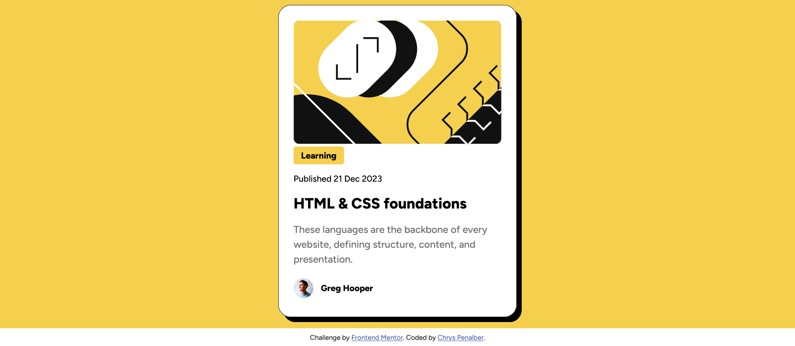

# Frontend Mentor - Blog Preview Card Solution

This is a solution to the [Blog Preview Card Challenge on Frontend Mentor](https://www.frontendmentor.io/challenges/).

## Table of Contents

- [Overview](#overview)
  - [Screenshot](#screenshot)
  - [Links](#links)
- [My Process](#my-process)
  - [Built With](#built-with)
  - [What I Learned](#what-i-learned)
  - [Continued Development](#continued-development)
  - [Useful Resources](#useful-resources)
- [Author](#author)

## Overview

This is a responsive blog preview card component built using HTML and CSS. The card layout is structured and designed to be visually appealing, with hover effects and smooth transitions.

### Screenshot



### Links

- [Solution URL](https://github.com/chryspenalber/blog-preview-card)
- [Live Site](https://chryspenalber.github.io/blog-preview-card/)

## My Process

My process for this challenge involved structuring the page with semantic HTML and applying CSS for styling, layout, and responsiveness. I focused on proper spacing, typography, and hover effects to enhance user experience.

### Built With

- Semantic HTML5
- CSS custom properties
- Responsive design
- Google Fonts (Figtree)

**Semantic HTML Tags Used:**

```html
<main>

<header>
<h1>
<h2>
<p>
<div>
<footer>
```

**CSS Features:**

- **Custom Properties (CSS Variables):** Used to define a color scheme for easy customization.
- **Typography:**
  - Imported and applied the "Figtree" font from local assets.
  - Defined various font weights and sizes for consistency.
- **Box Model Adjustments:**
  - Applied `margin`, `padding`, and `border-radius` for proper element spacing.
  - Used `box-shadow` for a subtle 3D effect, enhancing the card's aesthetics.
- **Hover Effects:**
  - The card’s shadow increases on hover.
  - The title changes color when hovered.

### What I Learned

This project helped me practice working with:

- Custom fonts using `@font-face`.
- CSS transitions for smooth hover effects.
- Utilizing `clamp()` for responsive typography.
- Implementing a structured and scalable design approach.

### Continued Development

I plan to continue improving my skills in:

- Implementing more interactive elements using JavaScript.
- Enhancing accessibility features.
- Experimenting with advanced CSS animations and transitions.

### Useful Resources

- [MDN Web Docs - CSS Transitions](https://developer.mozilla.org/en-US/docs/Web/CSS/CSS_Transitions) - Helped me refine smooth hover animations.
- [Google Fonts](https://fonts.google.com/) - Reference for integrating custom typography.
- [CSS Tricks - Box Shadows](https://css-tricks.com/almanac/properties/b/box-shadow/) - Guide on improving shadow aesthetics.

## Author

- GitHub - [Chrys Penalber](https://github.com/chryspenalber)
- Frontend Mentor - [@chryspenalber](https://www.frontendmentor.io/profile/chryspenalber)

